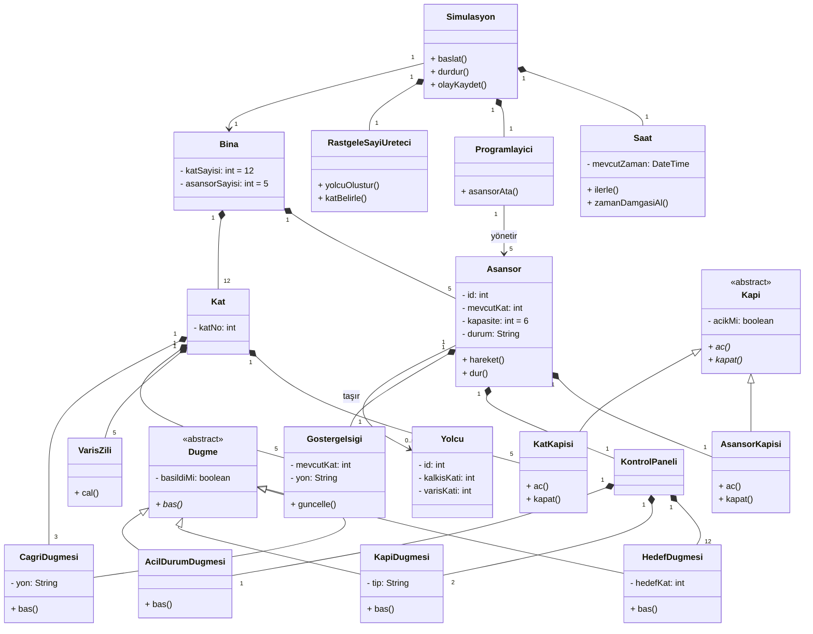

# Elevator Simulation System - Class Diagram

## Mermaid Diagram

## OOP Principles Applied

| Principle | Application |
|---|---|
| **Encapsulation** | Tüm sınıflarda `private` alanlar, `public` metodlar |
| **Inheritance** | `Kapi` → `AsansorKapisi` / `KatKapisi` — `Dugme` → 4 alt sınıf |
| **Polymorphism** | `ac()` / `kapat()` kapı tipine göre farklı davranır — `bas()` düğme tipine göre farklı davranır |
| **Abstraction** | `Kapi` ve `Dugme` abstract sınıflar, doğrudan örneklenemez |

## Architecture Notes

- `Kat` başına 5 `KatKapisi` + 5 `VarisZili` + 5 `GostergeIsigi` → her asansör boşluğu için birer tane
- `KontrolPaneli` başına 12 `HedefDugmesi` (12 kat), 2 `KapiDugmesi` (aç/kapat), 1 `AcilDurumDugmesi`
- `Simulasyon` her şeyi orkestre eder — `Saat`, `Programlayici` ve `RastgeleSayiUreteci` composition ile bağlıdır
