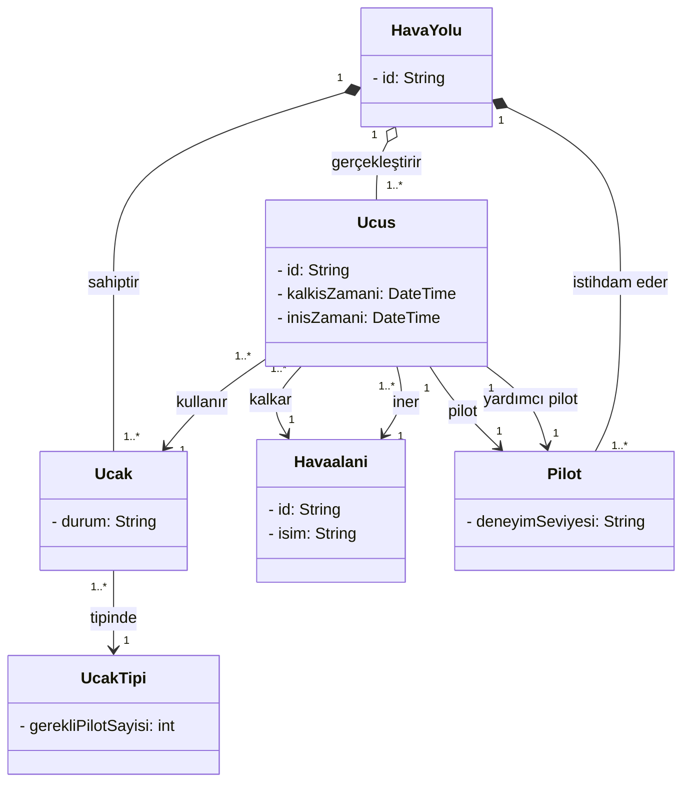

# Flight and Pilot Management System - Class Diagram

## Mermaid Diagram

## Relationships

| Relationship | Type | Description |
|---|---|---|
| `HavaYolu` → `Ucak` | Composition | Uçaklar havayoluna aittir |
| `HavaYolu` → `Pilot` | Composition | Pilotlar havayoluna aittir |
| `HavaYolu` → `Ucus` | Aggregation | Uçuşlar havayolu tarafından gerçekleştirilir |
| `Ucak` → `UcakTipi` | Association | Her uçak bir tipe sahiptir |
| `Ucus` → `Ucak` | Association | Uçuş bir uçakla gerçekleştirilir |
| `Ucus` → `Havaalani` (×2) | Association | Kalkış ve iniş havaalanları |
| `Ucus` → `Pilot` (×2) | Association | Pilot ve yardımcı pilot |

## Design Notes

- `Ucak` ve `UcakTipi` ayrı tutuldu — aynı tipte birden fazla uçak olabilir
- `UcakTipi.gerekliPilotSayisi` ile kaç pilot gerektiği tip bazında belirlenir
- `Ucus` → `Havaalani` ilişkisi iki kez kuruldu (kalkış / iniş)
