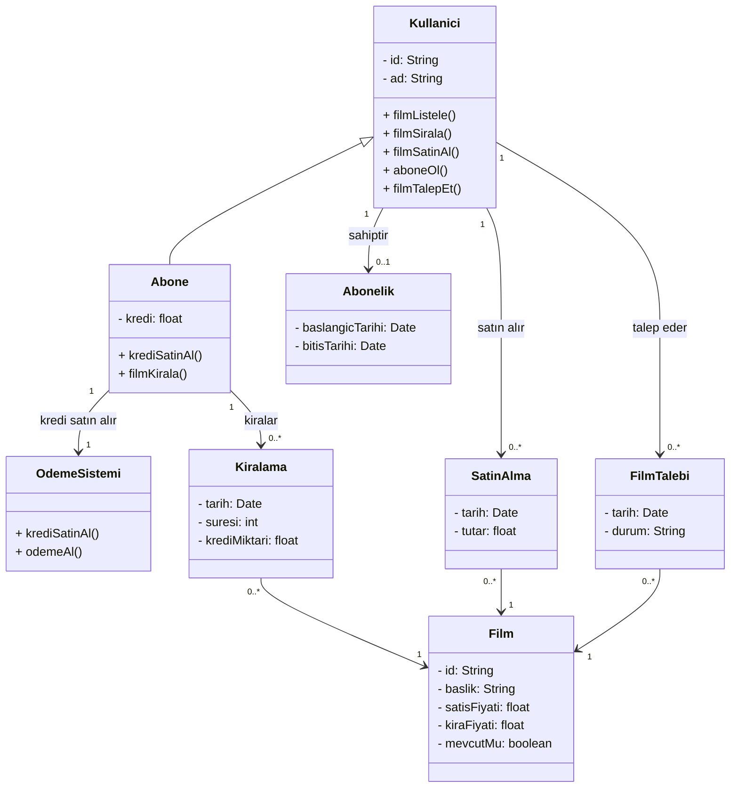

# Online Movie Sales and Rental System - Class Diagram

## Mermaid Diagram

## Design Decisions

| Decision | Description |
|---|---|
| `Kullanici` → `Abone` | Kalıtım — abone, kullanıcının özel halidir |
| `filmSatinAl()` Kullanici'da | Hem normal hem abone satın alabilir |
| `filmKirala()` Abone'da | Sadece aboneler kiralayabilir |
| `filmTalepEt()` Kullanici'da | Film mevcut değilse her kullanıcı talep edebilir |
| `Kiralama.krediMiktari` | Kiralama anında hesaptan düşülen kredi miktarı kaydedilir |
| `OdemeSistemi` ayrı sınıf | Kredi satın alma işlemi bağımsız bir sistem üzerinden yürütülür |
| `Film.mevcutMu` | Filmin mevcut olup olmadığı — talep mekanizmasını tetikler |
