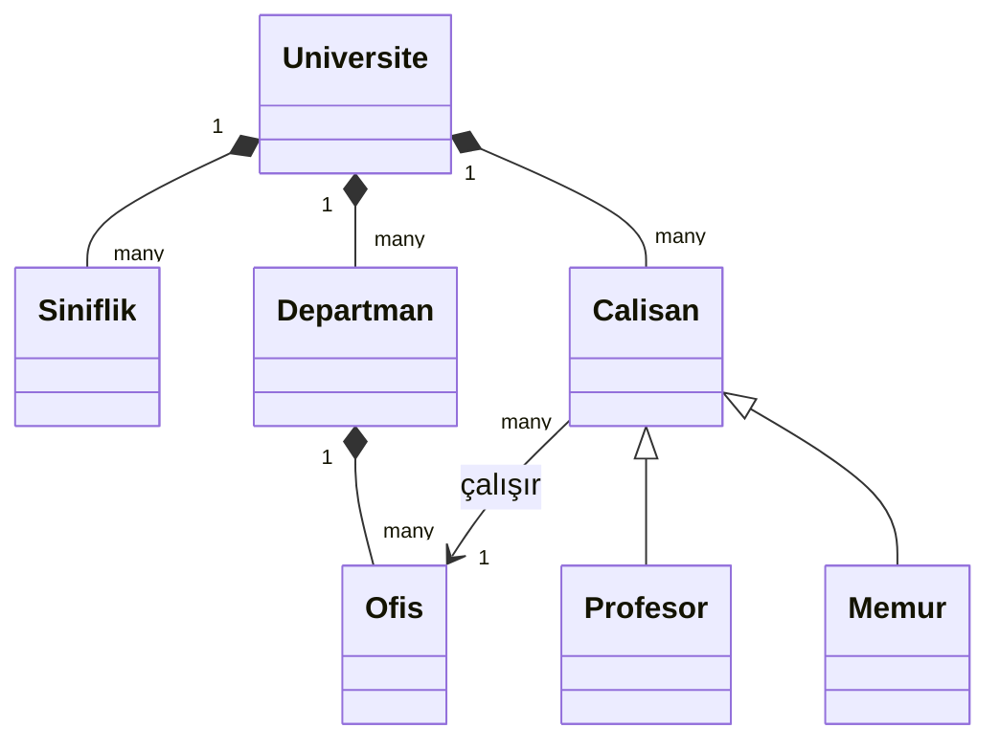

# University Class Diagram

## Mermaid Diagram

## Relationships

| Relationship | Type | Description |
|---|---|---|
| `Universite` → `Siniflik` | Composition | Sınıflıklar üniversiteye aittir |
| `Universite` → `Departman` | Composition | Departmanlar üniversiteye aittir |
| `Universite` → `Calisan` | Composition | Çalışanlar üniversiteye aittir |
| `Departman` → `Ofis` | Composition | Ofisler bir departmana aittir |
| `Calisan` → `Ofis` | Association | Her çalışan bir ofiste çalışır |
| `Calisan` ← `Profesor` / `Memur` | Inheritance | Profesör ve Memur, Calisan'ın alt sınıflarıdır |
