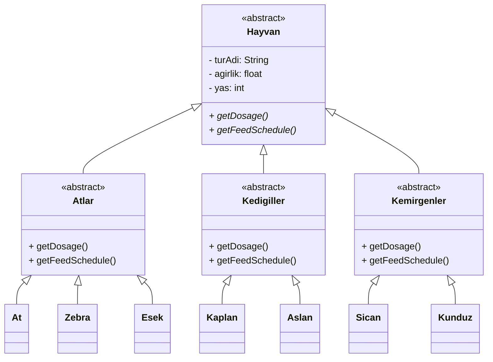

# Zoo Management System - Class Diagram

## Mermaid Diagram



## Design Decisions

| Decision | Description |
|---|---|
| `Hayvan` abstract | Common attributes here, cannot be instantiated directly |
| `getDosage()` / `getFeedSchedule()` abstract | Forces subclasses to override |
| `Atlar`, `Kedigiller`, `Kemirgenler` abstract | Each group implements its own algorithm |
| Concrete classes (`At`, `Kaplan` etc.) | Inherit from group class, no override needed unless extra behavior required |

## Polymorphism Example

```java
Hayvan h = new Kaplan();
h.getFeedSchedule();  // Kedigiller algorithm runs

Hayvan h = new Zebra();
h.getFeedSchedule();  // Atlar algorithm runs
```
